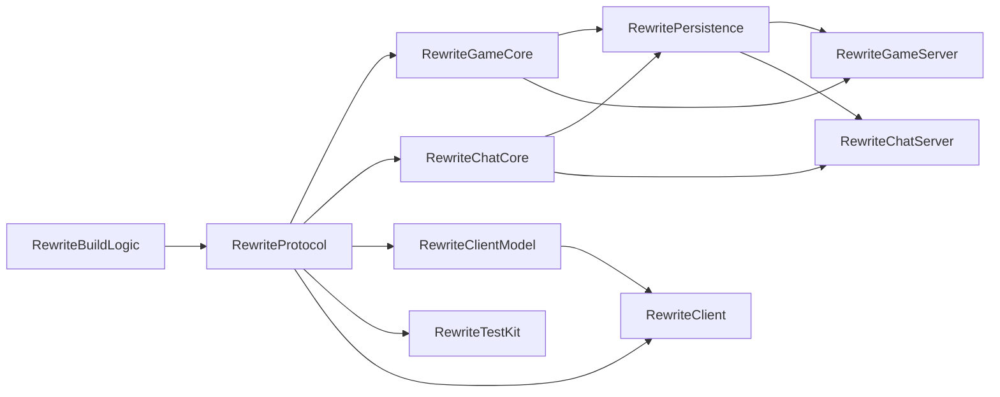

# HackWars Rewrite Master Plan

## Status Dashboard
- Program status: `in_progress`
- Current milestone: `Milestone 2 with Milestone 6 prep`
- Last completed milestone: `Milestone 5 typed game-core tranche`
- Locked architecture decisions: `accepted`
- Living documents status: `active`
- Rewrite scaffold status: `active`

## Locked Decisions
- Rewrite beside legacy, never on top of it.
- New application modules only: `:RewriteGameServer`, `:RewriteChatServer`, `:RewriteClient`.
- Supporting rewrite modules are allowed and required: `:RewriteBuildLogic`, `:RewriteProtocol`, `:RewriteGameCore`, `:RewriteChatCore`, `:RewritePersistence`, `:RewriteClientModel`, `:RewriteTestKit`.
- Rewrite modules are Kotlin-only. No Java source files are allowed.
- Rewrite modules may not depend on legacy runtime modules.
- Networking is framed TCP + protobuf, one bidirectional connection per service per client.
- `:RewriteProtocol` owns the new wire contract and Kotlin-only generation.
- Persistence is new PostgreSQL + Docker + Liquibase + legacy importer.
- Login UI is the only code-copy exception.
- All other runtime code is rewrite-only.

## Module Graph


## Dependency Rules
- Allowed rewrite project dependencies are only other rewrite modules.
- Forbidden dependencies include every legacy runtime module, especially `:GameServer`, `:ChatServer`, `:Client`, `:Networking`, `:HackWars`, and `:Data`.
- Legacy code, tests, resources, and docs may be read as evidence only.
- Legacy code may not be copied except the login UI exception.

## Commit Policy
- Each task card must be small enough for one worker or two workers with disjoint write scopes.
- Every worker must update the relevant `PLAN.md` in the same commit as the code change.
- Every worker must run the task’s verification command before commit.
- No commit is allowed with failing tests in the owned scope.
- Commit often, but only on green verification for the owned slice.

## Subagent Policy
- Explorer agents: evidence gathering only, no production writes.
- Worker agents: explicit ownership, explicit write scope, explicit verification command.
- Workers must not revert or overwrite unrelated changes.
- Safe early parallel lanes:
  - plan docs and feature inventory
  - build logic and module scaffolding
  - protocol layer
  - PostgreSQL and migration tooling
  - legacy importer analysis
- Safe later parallel lanes:
  - game command families with disjoint packages
  - client window families with disjoint packages
  - chat server lane once protocol is stable

## Milestone Board
| Milestone | Title | Status | Exit Criteria |
| --- | --- | --- | --- |
| M0 | Living plan documents | `done` | All `plans/rewrite/**/PLAN.md` files exist and use the common task-card template. |
| M1 | Rewrite scaffold and enforcement | `done` | All rewrite modules exist, no-Java and no-legacy-dependency checks exist, rewrite lifecycle tasks exist, and the scaffold builds green. |
| M2 | Feature inventory | `in_progress` | Every player-visible feature row exists with evidence, tests, and scope tags. |
| M3 | Transport and auth foundation | `in_progress` | Framed TCP + protobuf + auth handshake + offline fake services are green. |
| M4 | PostgreSQL + migrations + importer skeleton | `in_progress` | Dockerized Postgres, Liquibase, rollback validation, and importer skeleton are green. |
| M5 | Game core | `done` | State store, interest registry, command dispatcher, request callbacks, snapshots, and program scheduler are green. |
| M6 | Game feature slices | `todo` | Session, filesystem, economy, network, combat, and Hacktendo server slices are green. |
| M7 | Chat server parity | `todo` | Chat sessions, channels, relations, moderation, and fanout are green. |
| M8 | Client shell | `todo` | Copied login UI, root controller, stores, selectors, and base MVC are green. |
| M9 | Client window families | `todo` | All window families are ported with parity tests. |
| M10 | Full rewrite integration | `todo` | Real servers + real Postgres + real client integration suite is green. |
| M11 | Parity audit and closure | `todo` | Every required feature row is `done` and linked to passing tests. |

## Task Card Template
```md
### RW-XXX - Title
- Status: `todo|in_progress|blocked|done`
- Owner: `unassigned`
- Depends on: `none`
- Allowed write scope: `specific files/modules only`
- Verification command: `./gradlew ...`
- Artifacts: `build/reports/...` or `none`
- Commit rule: `single green commit only`
- Notes:
  - detail 1
  - detail 2
```

## Initial Tasks
### RW-M0-001 - Create rewrite plan document set
- Status: `done`
- Owner: `codex`
- Depends on: `none`
- Allowed write scope: `plans/rewrite/**`
- Verification command: `test -f plans/rewrite/PLAN.md`
- Artifacts: `plans/rewrite/**/PLAN.md`
- Commit rule: `single green commit only`
- Notes:
  - Created the master plan, subsystem plans, testing plan, data plan, and feature inventory.
  - Seeded every file with the common task-card template and status markers.

### RW-M1-001 - Add rewrite module graph to Gradle
- Status: `done`
- Owner: `codex`
- Depends on: `RW-M0-001`
- Allowed write scope: `settings.gradle`, `build.gradle`, `src/Rewrite*/build.gradle`
- Verification command: `./gradlew rewriteCheck`
- Artifacts: `build/reports/tests`
- Commit rule: `single green commit only`
- Notes:
  - Added all rewrite modules to `settings.gradle`.
  - Added root rewrite lifecycle tasks and subproject wiring.

### RW-M1-002 - Enforce no-Java and no-legacy-dependency rules
- Status: `done`
- Owner: `codex`
- Depends on: `RW-M1-001`
- Allowed write scope: `build.gradle`
- Verification command: `./gradlew rewriteNoJava rewriteNoLegacyDeps`
- Artifacts: `console output`
- Commit rule: `single green commit only`
- Notes:
  - Rewrite modules now fail verification if Java sources are present.
  - Rewrite modules now fail verification if they depend on legacy projects.

### RW-M1-003 - Stabilize rewrite build conventions
- Status: `done`
- Owner: `unassigned`
- Depends on: `RW-M1-001`
- Allowed write scope: `src/RewriteBuildLogic/**`, `src/Rewrite*/build.gradle`, `build.gradle`
- Verification command: `./gradlew rewriteCheck`
- Artifacts: `build/reports/tests`
- Commit rule: `single green commit only`
- Notes:
  - Rewrite modules now use the shared rewrite conventions and Kotlin source roots.
  - Wire, Liquibase, test source-set, and artifact conventions are scaffolded for the rewrite modules.

### RW-M2-001 - Complete game feature inventory evidence lane
- Status: `in_progress`
- Owner: `unassigned`
- Depends on: `RW-M1-003`
- Allowed write scope: `plans/rewrite/feature-inventory/PLAN.md`
- Verification command: `rg -n "RequestAttackTest|RequestScanTest|RequestWebpageTest|DoChallengeTest|HacktendoActivateTest" plans/rewrite/feature-inventory/PLAN.md`
- Artifacts: `plans/rewrite/feature-inventory/PLAN.md`
- Commit rule: `single green commit only`
- Notes:
  - Map the legacy game RPC and function tests to feature rows with concrete evidence.
  - Keep player-visible game behavior, broken flows, and request/response semantics explicit.

### RW-M2-002 - Complete client UI evidence lane
- Status: `in_progress`
- Owner: `unassigned`
- Depends on: `RW-M1-003`
- Allowed write scope: `plans/rewrite/feature-inventory/PLAN.md`
- Verification command: `rg -n "ClientWindowWorkflowTest|LoginSceneAuthGatewayTest|LoginBackgroundPanelTest" plans/rewrite/feature-inventory/PLAN.md`
- Artifacts: `plans/rewrite/feature-inventory/PLAN.md`
- Commit rule: `single green commit only`
- Notes:
  - Tie every desktop window family to the current integration UI workflow and login tests.
  - Keep the expected-failure browser and Hacktendo player workflows visible in the matrix.

### RW-M2-003 - Complete chat and protocol evidence lane
- Status: `in_progress`
- Owner: `unassigned`
- Depends on: `RW-M1-003`
- Allowed write scope: `plans/rewrite/feature-inventory/PLAN.md`, `plans/rewrite/chat-server/PLAN.md`
- Verification command: `rg -n "OfflineStackProtocolIntegrationTest|client-game-server-auth|00-current-protocol-audit|00b-chat-message-signatures" plans/rewrite/feature-inventory/PLAN.md plans/rewrite/chat-server/PLAN.md`
- Artifacts: `plans/rewrite/feature-inventory/PLAN.md`
- Commit rule: `single green commit only`
- Notes:
  - Capture the auth/session, ping, chat message, and fanout evidence in the parity ledger.
  - Keep the protocol docs aligned with the rewrite transport assumptions.

### RW-M2-004 - Track known broken workflows and parity gaps
- Status: `in_progress`
- Owner: `unassigned`
- Depends on: `RW-M2-001`
- Allowed write scope: `plans/rewrite/feature-inventory/PLAN.md`, `plans/rewrite/testing/PLAN.md`
- Verification command: `rg -n "ExpectedFailure|known broken|Hacktendo player|web browser" plans/rewrite/feature-inventory/PLAN.md plans/rewrite/testing/PLAN.md`
- Artifacts: `plans/rewrite/feature-inventory/PLAN.md`
- Commit rule: `single green commit only`
- Notes:
  - Ensure broken-but-required workflows remain visible rather than hidden or skipped.
  - Keep parity gaps actionable for later implementation milestones.

### RW-M3-001 - Freeze session-ticket auth contract and frame codec
- Status: `done`
- Owner: `codex`
- Depends on: `RW-M1-003`
- Allowed write scope: `:RewriteProtocol`
- Verification command: `./gradlew :RewriteProtocol:test`
- Artifacts: `src/RewriteProtocol/build/generated/source/wire`
- Commit rule: `single green commit only`
- Notes:
  - Auth now uses `session_ticket` instead of JWT.
  - Framed protobuf codec and connection state-machine primitives are implemented and tested.

### RW-M3-002 - Build offline transport harness and fake auth services
- Status: `done`
- Owner: `codex`
- Depends on: `RW-M3-001`
- Allowed write scope: `:RewriteTestKit`
- Verification command: `./gradlew :RewriteTestKit:integrationTest`
- Artifacts: `src/RewriteTestKit/build/reports/tests/integrationTest`
- Commit rule: `single green commit only`
- Notes:
  - In-memory service harness covers auth success/failure, ping, timeouts, request/response correlation, and push delivery.
  - Shared fake session-ticket verifier and stub game/chat adapters are available for follow-on milestones.

### RW-M4-001 - Bootstrap rewrite PostgreSQL schema and rollback validation
- Status: `done`
- Owner: `codex`
- Depends on: `RW-M1-003`
- Allowed write scope: `docker-compose.rewrite.yml`, `:RewritePersistence`
- Verification command: `./gradlew :RewritePersistence:test :RewritePersistence:migrationTest`
- Artifacts: `src/RewritePersistence/build/reports/tests`
- Commit rule: `single green commit only`
- Notes:
  - Docker Compose runtime, Liquibase bootstrap schema, and rollback smoke coverage are in place.
  - Event and snapshot tables now exist in the rewrite-owned schema.

### RW-M4-002 - Add importer planning skeleton and migration smoke coverage
- Status: `done`
- Owner: `codex`
- Depends on: `RW-M4-001`
- Allowed write scope: `:RewritePersistence`
- Verification command: `./gradlew :RewritePersistence:test :RewritePersistence:migrationTest`
- Artifacts: `src/RewritePersistence/build/reports/tests`
- Commit rule: `single green commit only`
- Notes:
  - Legacy MySQL/XML/JSON descriptors now map to rewrite seed batches without touching legacy runtime code.
  - JDBC-backed seed sink smoke coverage now writes minimal player, computer, and inventory slices into the rewrite schema.
  - Canonical schema breadth and end-to-end migrated-login validation are still pending.

### RW-M5-001 - Land typed Kotlin game-core contracts and scheduler
- Status: `done`
- Owner: `codex`
- Depends on: `RW-M3-001`, `RW-M4-001`
- Allowed write scope: `:RewriteGameCore`
- Verification command: `./gradlew :RewriteGameCore:test`
- Artifacts: `src/RewriteGameCore/build/reports/tests/test`
- Commit rule: `single green commit only`
- Notes:
  - `ComputerState`, `ComputerEvent`, `ComputerDelta`, `ProgramUpdate`, `CommandRegistry`, `InterestRegistry`, and typed commands now exist in Kotlin-first form.
  - Request callbacks, stable lock ordering, and coroutine program scheduling are covered by unit tests.

### RW-M5-002 - Add typed persistence adapters for state, events, and snapshots
- Status: `done`
- Owner: `codex`
- Depends on: `RW-M5-001`, `RW-DATA-002`
- Allowed write scope: `:RewritePersistence`
- Verification command: `./gradlew :RewritePersistence:test :RewritePersistence:migrationTest`
- Artifacts: `src/RewritePersistence/build/reports/tests`
- Commit rule: `single green commit only`
- Notes:
  - JDBC repository, JSON-byte serializer, snapshot threshold logic, and deterministic replay coverage are in place.
  - Base-state imports remain structural and still need broader legacy schema mapping.

### RW-M5-003 - Prove typed bootstrap, scan, and preference mutation through the rewrite transport harness
- Status: `done`
- Owner: `codex`
- Depends on: `RW-M5-001`, `RW-M3-002`
- Allowed write scope: `:RewriteGameServer`, `:RewriteGameCore`
- Verification command: `./gradlew :RewriteGameServer:test :RewriteTestKit:integrationTest`
- Artifacts: `src/RewriteGameServer/build/reports/tests/test`
- Commit rule: `single green commit only`
- Notes:
  - Session bootstrap now emits exactly one full snapshot after auth.
  - `requestscan` is request/response-only, and `setpreferences` now proves event-first mutation plus delta fanout.

## Glossary
- `Game state`: the authoritative server-side state for exactly one computer or IP-addressed entity.
- `Snapshot`: full serialized state image written to PostgreSQL.
- `Event`: append-only mutation record written immediately on accepted mutation.
- `Delta`: targeted post-login state change payload for interested clients.
- `Program command`: long-running isolated command such as attack or redirect.
- `Selector`: fine-grained client subscription that only emits when its projected value changes.
